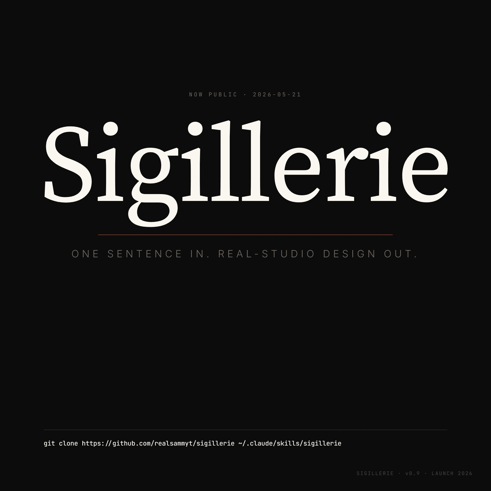
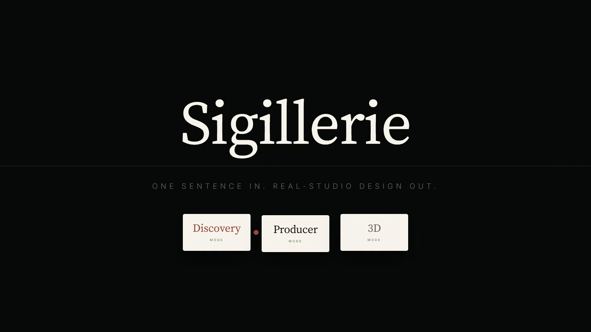
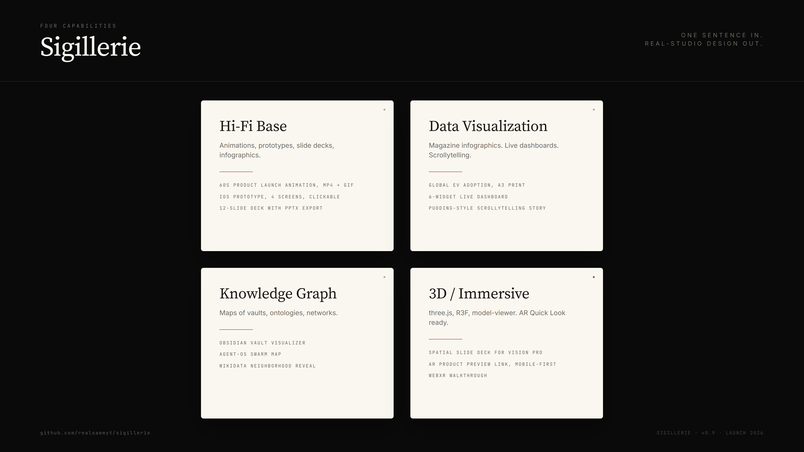
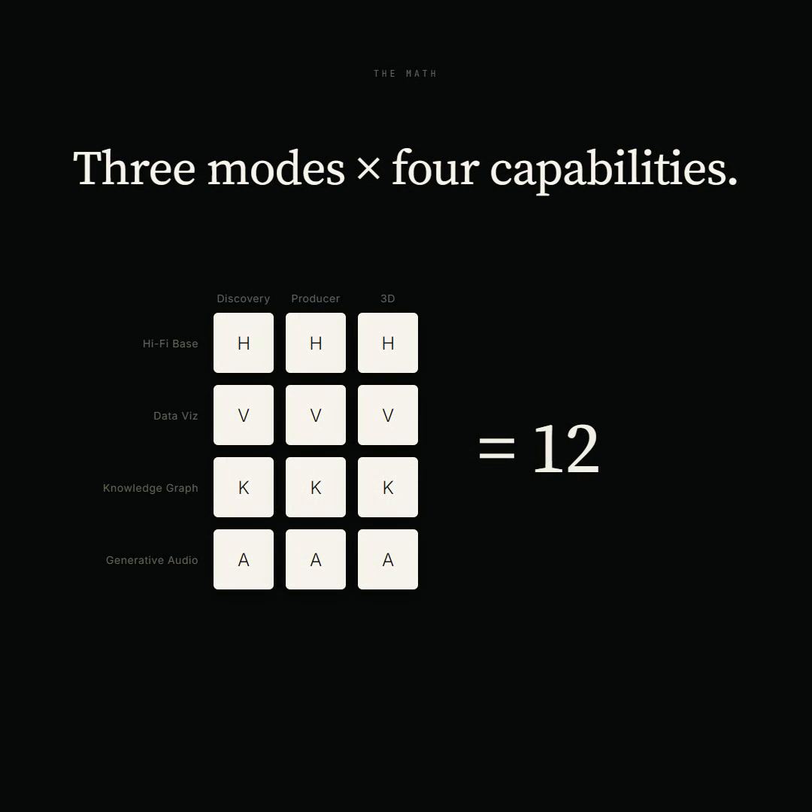
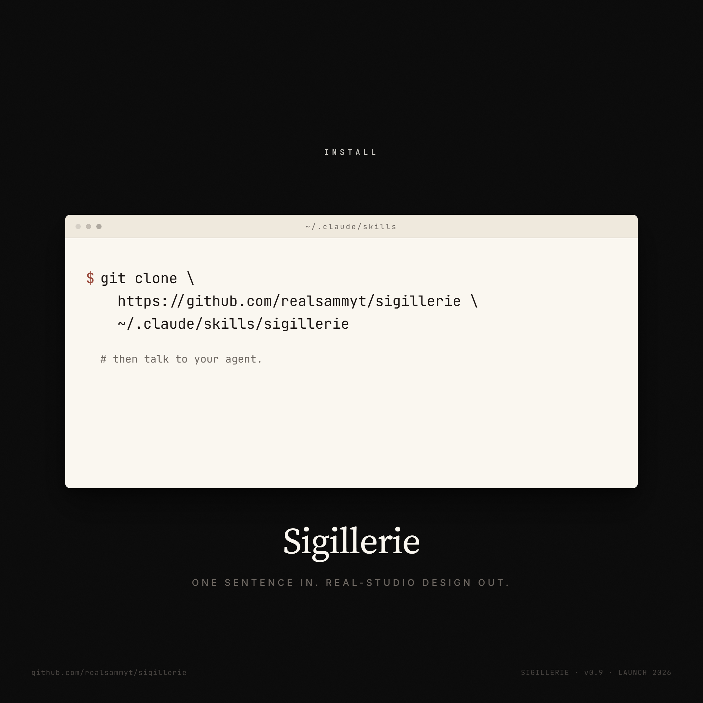

# Sigillerie

> *One sentence in. Real-studio design out.*

A Claude Code skill that ships single-file HTML design deliverables: animations, app prototypes, slide decks, magazine infographics, data viz, knowledge graphs, 3D / immersive scenes, with optional generative audio. English-canonical, agent-driven, brand-spec-backed.

```
git clone https://github.com/realsammyt/sigillerie.git ~/.claude/skills/sigillerie
```

Then talk to your agent.

## Launch · now public



Six dogfooded launch posts, authored by a parallel team of agents driving the skill on itself. Each is a single-file HTML deliverable in [`launch/posts/`](launch/posts/); rendered stills, MP4s, and GIFs are in [`launch/renders/`](launch/renders/). The agent-driven self-brand-spec that gave them shared identity is at [`launch/brand-spec.md`](launch/brand-spec.md).

| Post | Aspect | Format | Source | Render |
|---|---|---|---|---|
| Announcement card | 1080×1080 | static | [HTML](launch/posts/p1-announcement-square/) | [PNG](launch/renders/p1.png) |
| Hero animation | 1920×1080 | 8 s loop | [HTML](launch/posts/p2-hero-wide/) | [MP4](launch/renders/p2.mp4) · [GIF](launch/renders/p2.gif) · [poster](launch/renders/p2-poster.png) |
| Capability grid | 1920×1080 | static | [HTML](launch/posts/p3-capability-grid-wide/) | [PNG](launch/renders/p3.png) |
| Modes × capabilities = 12 | 1080×1080 | 9 s loop | [HTML](launch/posts/p4-matrix-square/) | [MP4](launch/renders/p4.mp4) · [GIF](launch/renders/p4.gif) · [poster](launch/renders/p4-poster.png) |
| Vertical short (Reels / Shorts / TikTok) | 1080×1920 | 7 s loop | [HTML](launch/posts/p5-vertical-short/) | [MP4](launch/renders/p5.mp4) · [GIF](launch/renders/p5.gif) · [poster](launch/renders/p5-poster.png) |
| One-command install | 1080×1080 | static | [HTML](launch/posts/p6-install-square/) | [PNG](launch/renders/p6.png) |

### Hero animation



### Capability grid



### The math



### Install



How they were built: one agent extracted a self brand-spec for Sigillerie from `SKILL.md`, the existing hero demo, and the voice rules. Six parallel agents each authored one post HTML following that spec, the Sigillerie page contract (`window.__ready`, `window.__duration`, `window.__recording`), and the anti-AI-slop catalog. A local renderer (`launch/render-video-local.mjs`) patched two recording snags in the Stage component (controls bar visible during capture, and an `innerHeight - 56` reservation that letterboxed the canvas) via `addInitScript` only, no edits to the upstream component. Total wall-clock: ~12 minutes of agent work, ~3 minutes of render.

## What it makes

| Capability | Example briefs |
|---|---|
| **Hi-Fi Base** | "60-second product launch animation, MP4 + GIF + BGM" · "iOS prototype for a Pomodoro app, 4 screens, clickable" · "12-slide deck with editable PPTX export" |
| **Data Viz** | "Magazine infographic on global EV adoption, A3 print" · "Live dashboard, 6 widgets, real-time" · "Animated data story, 30s reveal" · "Pudding-style scrollytelling" |
| **Knowledge Graph** | "Visualize my Obsidian vault" · "Map my agent-os swarm" · "Citation network for [paper]" · "Wikidata neighborhood, 60s reveal MP4" |
| **Generative Audio** | "Score this deck with brand-aware BGM" · "Generative ambient for a kiosk" · "Spatial 3D scene with Doppler" · "Sonified data piece" |
| **3D / Immersive** | "Spatial slide deck for Vision Pro" · "AR product preview link, mobile-first" · "WebXR room-scale walkthrough" · "Holo-UI mockup, glasses HUD frame" |

## Three modes

- **Discovery Studio**: brand-from-nothing. 6-phase guided pipeline (Intake → Moodboard → Direction → Asset Build → Spec → Hand-off). Three differentiated options at every step. Mix-and-match supported. 35–55 min wall-clock for a full run.
- **Producer**: execute a brief at hi-fi. Anti-AI-slop discipline, brand-asset protocol, junior-pass workflow, 5/7-dim critique, three numeric dials.
- **3D / Immersive**: three.js Track A single-file, shipped today. R3F Track B (build-step) and `<model-viewer>` AR are planned; their reference docs are stubs.

Modes compose. Capabilities compose with modes. A `/walkthrough` of a `/kg` deliverable runs through 3D mode (Track B WebXR output is on the roadmap, not shipped).

## Quick examples

```
/discover Vellum, calm reading app
/3d product hero glass headphones
/viz sales-q4.csv
/kg agent-os
/spatial deck on AI psychology
/audio brand for [brand]
```

## Showcase

Four single-file HTML demos, one per capability. Each demonstrates the FIX side of the named anti-patterns in its capability's catalog.

### Data Viz


A 4-panel chart deck (`demos-viz/d1-anti-pattern-showcase/`). Recipes: Buried Lead, Flat Deck, Loading Void, Rainbow Categorical, Unlabeled Axis, Legend Orphan, Anticlimactic Summary.

### Knowledge Graph


A 30-node citation network with progressive disclosure (`demos-kg/d1-anti-pattern-showcase/`). Recipes: Hairball-at-Load, No Entry Node, Isotropic Nodes, Edge Spaghetti, Undifferentiated Cluster Mass, Offscreen Legend, Unlabeled Edges.

### Generative Audio


A Tone.js 16-bar loop with the Q5 loop-Peak codified at bars 12-13 (`demos-audio/d1-anti-pattern-showcase/`). Recipes: Cold Audio Start, Uniform Texture, Loop Seam, Motif Overload, Audio-Only State Signal, Tab-Throttle Drift.

### 3D / Immersive


Adaptive spatial UI across 4 aspect ratios (`demos3d/d6-holo-ui/`). Uses `@pmndrs/uikit` with the `applySpatialVitrine` preset (frosted glass + warm sunset + bloom + chromatic). Hero+overlay depth ladder per `aesthetic.md §10`.

### Running the demos locally

Most demos need `http://` rather than `file://`. From the repo root:

```
python -m http.server 8080
```

Then open any demo at `http://localhost:8080/demos-viz/d1-anti-pattern-showcase/` (or the other paths).

For design review, `scripts/screenshot-demo.mjs` captures all four aspect ratios (1920x1080 / 1080x1080 / 1080x1920 / 3440x1440) at once. Pair with the global `visual-review` skill to score a demo against the project's own critique rubric.

## What it doesn't do

- iOS Safari WebXR (unsupported at last check, 2026-07; AR Quick Look is the planned iOS path)
- visionOS WebXR-AR passthrough (non-functional at last check, 2026-07; ships VR-only on Vision Pro)
- 5.1 / Atmos surround MP4 export (browser limit)
- Server-side three.js renderer
- Figma round-trip
- Production web-app code (use `frontend-design`)

## License

Personal use unrestricted. Commercial use requires authorization. See `LICENSE`.

## Lineage

Discipline borrowed from [`alchaincyf/huashu-design`](https://github.com/alchaincyf/huashu-design) (花叔Design): anti-AI-slop catalog, core asset protocol, Junior Designer workflow, 5-dim critique, 20-philosophy direction advisor. Re-authored English-canonical and extended with Discovery, three new capabilities, 3D / immersive layer.

The dial system shape (DESIGN_VARIANCE / MOTION_INTENSITY / VISUAL_DENSITY) is influenced by [`Leonxlnx/taste-skill`](https://github.com/Leonxlnx/taste-skill), re-grounded in sigillerie's single-file HTML / three.js stack. The `Copy Slop` section in `content-guidelines.md` also draws from taste-skill's "AI Tells" filler-verb ban.

## Status

v0.9 plus. The skill registers globally, all three modes route, all capability layers have anti-pattern catalogs the critic agent scans by name, and reference demos live in `demos/`, `demos-viz/`, `demos-kg/`, `demos-audio/`, `demos3d/`. Shipped since the v0.9 tag: producer dials (#36), jsx-export Pass 5 (#38), and the public-launch campaign (#42).

Known carry-overs toward v1.0:
- AR Quick Look (Phase 5) waiting on the USDZ-on-Windows decision.
- WebXR Track B (Phase 6) scaffolding not started.
- d6-holo-ui stacked-z arc resolved in #34 (hero+overlay depth ladder); a post-fix critique re-run has not been recorded.
- Most reference docs under `capabilities/` and five under `modes/three3d/` are stubs. `npm test` runs real lint gates (banned vocab, frontmatter, dead links, glossary) plus budget and page-contract checks; agent-driven golden phases 2-11 report SKIP until a live harness exists.

See `SKILL.md` for routing rules. Build planning lives in the maintainer's private workspace, not in this repo.
