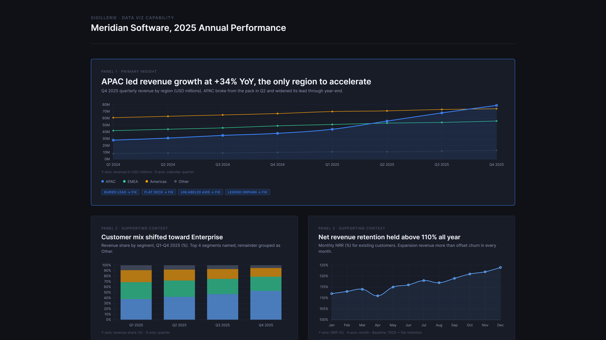
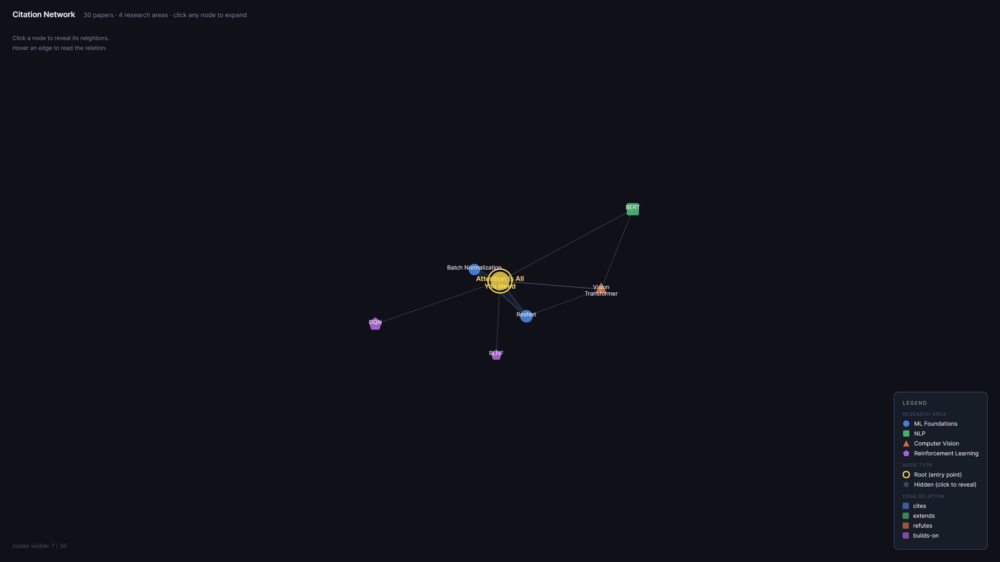
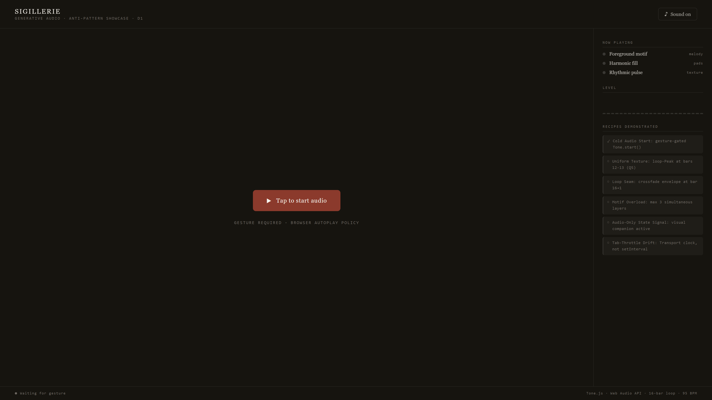
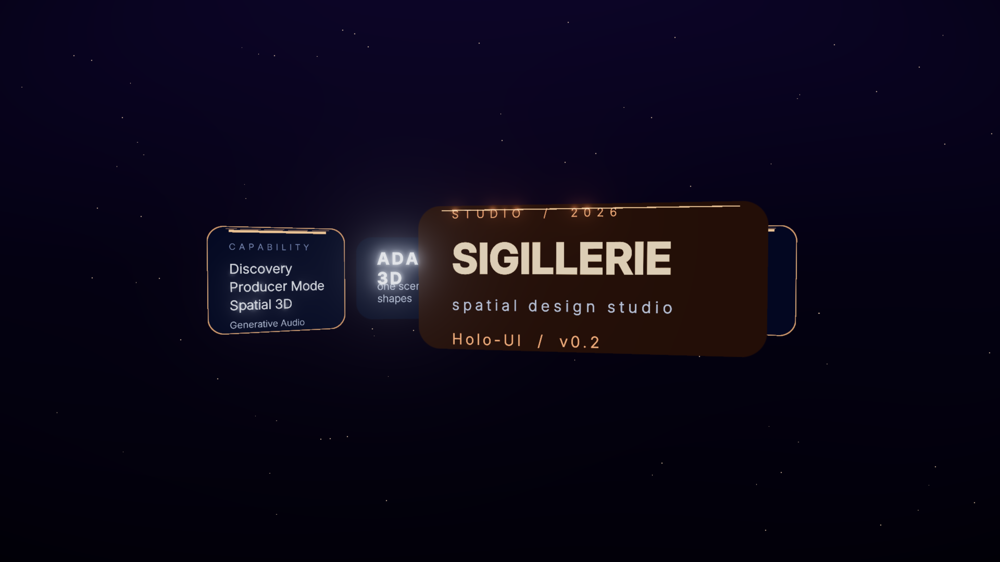

# Sigillerie

> *One sentence in. Real-studio design out.*

A Claude Code skill that ships single-file HTML design deliverables — animations, App prototypes, slide decks, magazine infographics, data viz, knowledge graphs, 3D / immersive scenes, with optional generative audio. English-canonical, agent-driven, brand-spec-backed.

```
git clone https://github.com/realsammyt/sigillerie.git ~/.claude/skills/sigillerie
```

Then talk to your agent.

## What it makes

| Capability | Example briefs |
|---|---|
| **Hi-Fi Base** | "60-second product launch animation, MP4 + GIF + BGM" · "iOS prototype for a Pomodoro app, 4 screens, clickable" · "12-slide deck with editable PPTX export" |
| **Data Viz** | "Magazine infographic on global EV adoption, A3 print" · "Live dashboard, 6 widgets, real-time" · "Animated data story, 30s reveal" · "Pudding-style scrollytelling" |
| **Knowledge Graph** | "Visualize my Obsidian vault" · "Map my agent-os swarm" · "Citation network for [paper]" · "Wikidata neighborhood, 60s reveal MP4" |
| **Generative Audio** | "Score this deck with brand-aware BGM" · "Generative ambient for a kiosk" · "Spatial 3D scene with Doppler" · "Sonified data piece" |
| **3D / Immersive** | "Spatial slide deck for Vision Pro" · "AR product preview link, mobile-first" · "WebXR room-scale walkthrough" · "Holo-UI mockup, glasses HUD frame" |

## Three modes

- **Discovery Studio** — brand-from-nothing. 6-phase guided pipeline (Intake → Moodboard → Direction → Asset Build → Spec → Hand-off). Three differentiated options at every step. Mix-and-match supported. 35–55 min wall-clock for a full run.
- **Producer** — execute a brief at hi-fi. Anti-AI-slop discipline, brand-asset protocol, junior-pass workflow, 5/7-dim critique.
- **3D / Immersive** — three.js (Track A single-file) + R3F (Track B build-step) + `<model-viewer>` for AR. WebGPU + WebGL2 unified.

Modes compose. Capabilities compose with modes. A `/walkthrough` of a `/kg` deliverable runs through 3D mode and emits a Track B WebXR project with generative spatial audio.

## Quick examples

```
/discover Vellum, calm reading app
/3d product hero glass headphones
/viz sales-q4.csv
/kg agent-os
/spatial deck on AI psychology
/audio brand for [brand]
```

## Showcase

Four single-file HTML demos, one per capability. Each demonstrates the FIX side of the named anti-patterns in its capability's catalog.

### Data Viz



A 4-panel chart deck (`demos-viz/d1-anti-pattern-showcase/`). Recipes: Buried Lead, Flat Deck, Loading Void, Rainbow Categorical, Unlabeled Axis, Legend Orphan, Anticlimactic Summary.

### Knowledge Graph



A 30-node citation network with progressive disclosure (`demos-kg/d1-anti-pattern-showcase/`). Recipes: Hairball-at-Load, No Entry Node, Isotropic Nodes, Edge Spaghetti, Undifferentiated Cluster Mass, Offscreen Legend, Unlabeled Edges.

### Generative Audio



A Tone.js 16-bar loop with the Q5 loop-Peak codified at bars 12-13 (`demos-audio/d1-anti-pattern-showcase/`). Recipes: Cold Audio Start, Uniform Texture, Loop Seam, Motif Overload, Audio-Only State Signal, Tab-Throttle Drift.

### 3D / Immersive



Adaptive spatial UI across 4 aspect ratios (`demos3d/d6-holo-ui/`). Uses `@pmndrs/uikit` with the `applySpatialVitrine` preset (frosted glass + warm sunset + bloom + chromatic). Hero+overlay depth ladder per `aesthetic.md §10`.

### Running the demos locally

Most demos need `http://` rather than `file://`. From the repo root:

```
python -m http.server 8080
```

Then open any demo at `http://localhost:8080/demos-viz/d1-anti-pattern-showcase/` (or the other paths).

For design review, `scripts/screenshot-demo.mjs` captures all four aspect ratios (1920x1080 / 1080x1080 / 1080x1920 / 3440x1440) at once. Pair with the global `visual-review` skill to score a demo against the project's own critique rubric.

## What it doesn't do

- iOS Safari WebXR (does not exist in 2026 — uses AR Quick Look instead)
- visionOS WebXR-AR passthrough (non-functional — ships VR-only on Vision Pro)
- 5.1 / Atmos surround MP4 export (browser limit)
- Server-side three.js renderer
- Figma round-trip
- Production web-app code (use `frontend-design`)

## License

Personal use unrestricted. Commercial use requires authorization. See `LICENSE`.

## Lineage

Discipline borrowed from [`alchaincyf/huashu-design`](https://github.com/alchaincyf/huashu-design) (花叔Design) — anti-AI-slop catalog, core asset protocol, Junior Designer workflow, 5-dim critique, 20-philosophy direction advisor. Re-authored English-canonical and extended with Discovery, three new capabilities, 3D / immersive layer.

## Status

v0.9, capabilities shipped. The skill registers globally, all three modes route, all five capability layers (Hi-Fi Base + Data Viz + Knowledge Graph + Generative Audio + 3D / Immersive) have anti-pattern catalogs the critic agent scans by name, and four reference demos live in `demos-viz/`, `demos-kg/`, `demos-audio/`, `demos3d/`.

Known carry-overs toward v1.0:
- AR Quick Look (Phase 5) waiting on the USDZ-on-Windows decision.
- WebXR Track B (Phase 6) scaffolding not started.
- d6-holo-ui spatial UI flagship demo holds at floor 6 in the critique guide due to a stacked-z arc that visually compresses (tracked in `_planning/HANDOFF-2026-05-15.md` Option J3).

See `SKILL.md` for routing rules and `_planning/` (workspace) for the build plan. The latest handoff lives at `_planning/HANDOFF-2026-05-15.md`.
